<div align="center">


</div>

# MEDIGREEN
>A pharmacy for aquatic, veterinary and agriculture.
>It helps the farmer with proper medicine and advice. It connect the farmer with the doctor also. It sells medicine with resonable price.

# Built With 

- Nodejs
- EJS
- Bootstrap
- OracleDB


# Getting Started

Follow the step by step installation procedure to install and run this on your machine

# Prerequisites

Make sure you have node and oracle installed in your device.

**`NodeJs`**: Install Nodejs from [here](https://nodejs.org/en/download/)

**`Oracle`**:Install Oracle from [here](http://www.oracle.com/index.html) and register for an account of your own


# Getting the repository

1. Clone the repo
   ```sh
   git clone https://github.com/bijoy111/Project-for-Level-2-Term-2.git
   ```

2. If you don't have git installed in your device then download the zip file and unzip it.


# Setting up the environment variables

change the file `.env` in the root directory. And the file should have the followings

```sh
DB_USER= YOUR_DB_USER 
DB_PASS= YOUR_DB_PASS
DB_CONNECTSTRING=localhost/orcl
PORT=YOUR_FABOURITE_PORT
APP_SECRET=YOUR_DARKEST_SECRET
```

# Run the project

>Open the repository in your own machine and then go Project-for-Level-2-Term-2 -> Database_Project_Code
>Open this  Database_Project_Code with "VS Code"
>Then change the .env file following the steps mentioned above
>Now go the indexRouter.js file under router folder and then open a new terminal
>Now type "nodemon index" in the terminal
>If you do not get any error then you file find the website by typing localhost:3005(what port number you set) in your web browser.


# Feature of the project at user's side 
>
>SignUp Page
>
>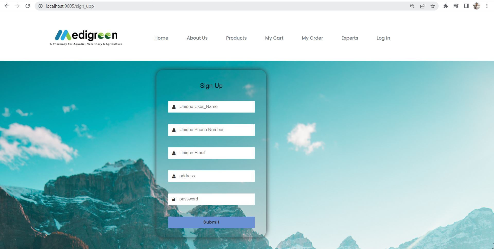
>
>Login Page
>
>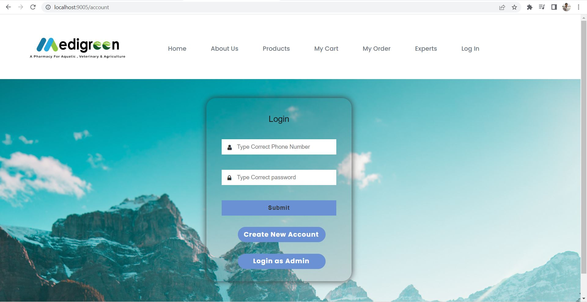
> 
>Home Page
>
>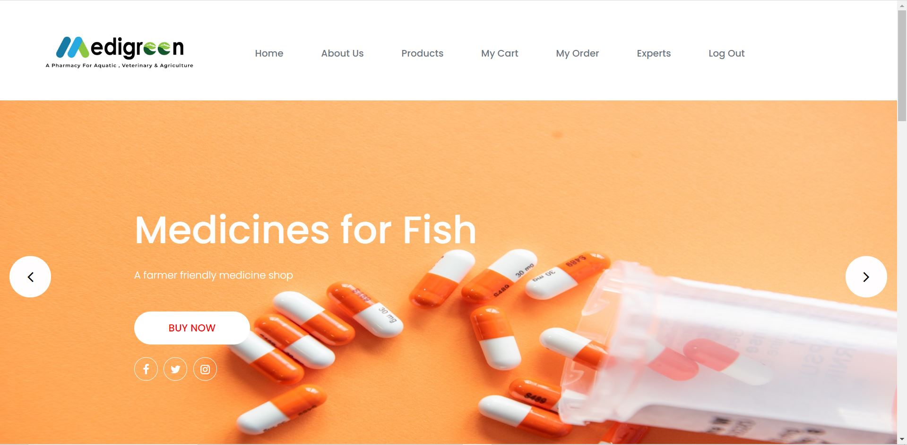
>
>About Us Page
>
>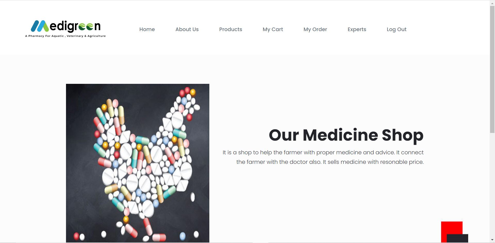
>
>Product Page
>
>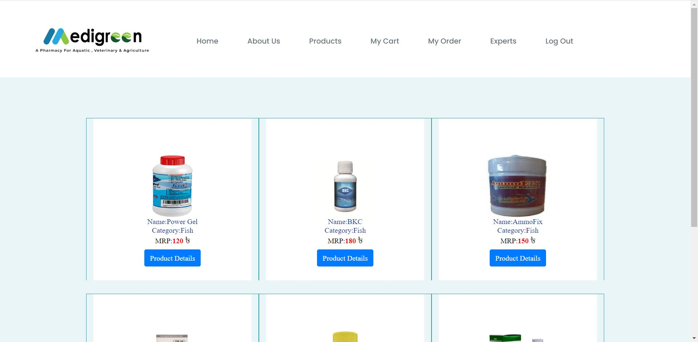
>
>My Cart Page
>
>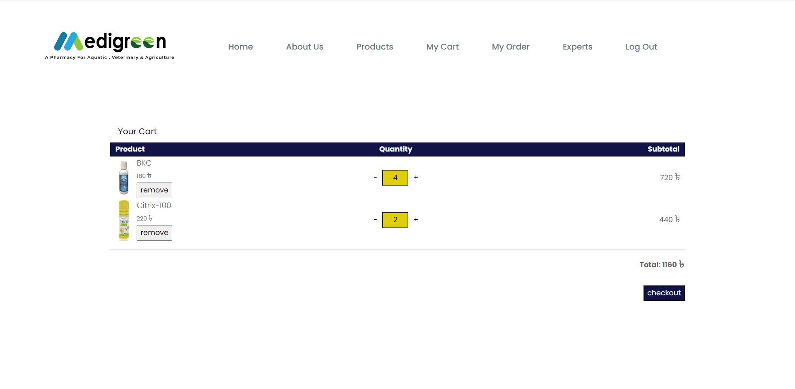
>
>Checkout Page
>
>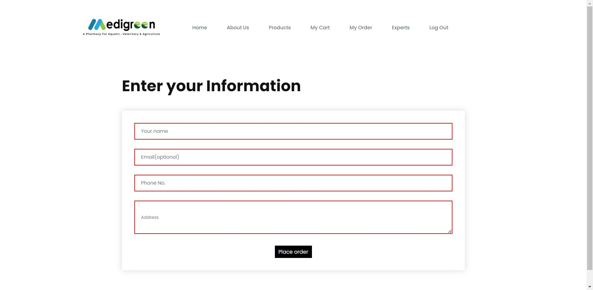
>
>My Order Page
>
>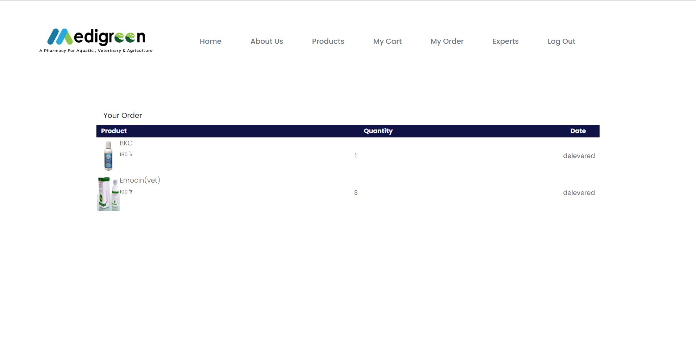
>
>Expert Page
>
>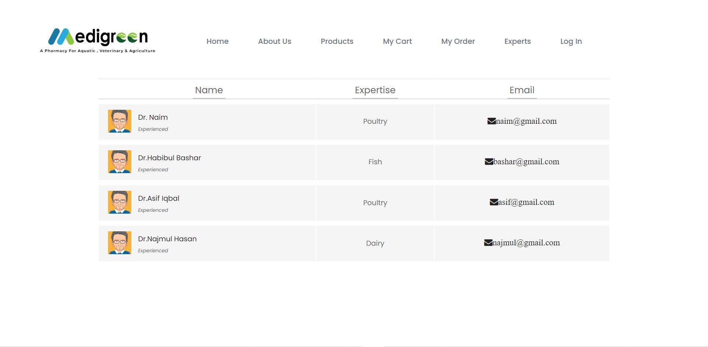
>
# Feature of the project at admin's side
>
>Admin Dashboard in light mode
>
>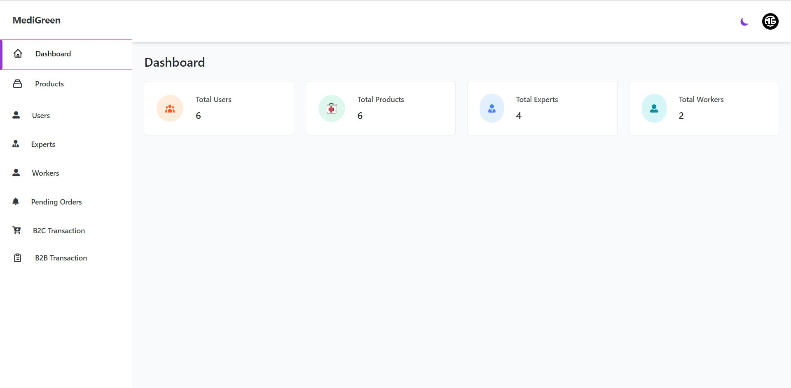
>
>Admin Dashboard in dark mode
>
>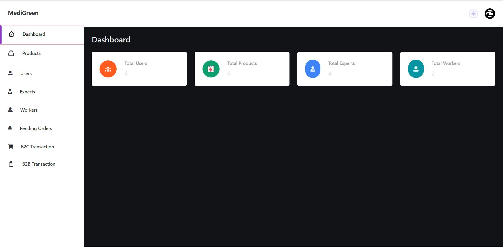
>
>Product List
>
>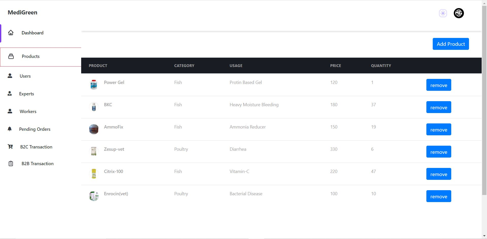
>
>Worker List
>
>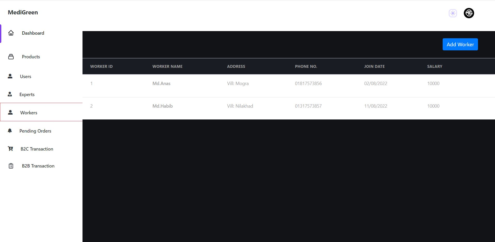
>
>Business to Client Transaction List
>
>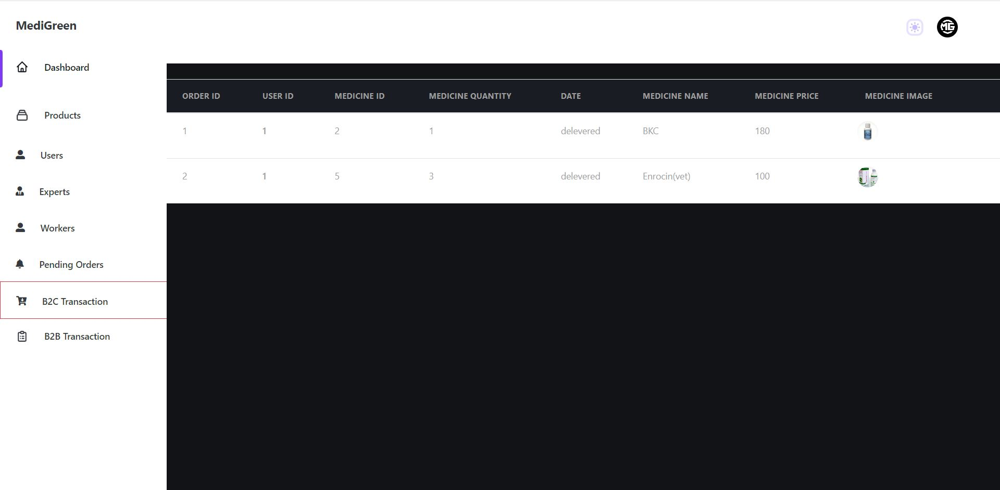
>
>Business to Business Tranction List
>
>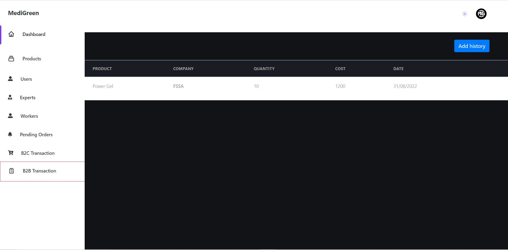
>
>Pending Order List
>
>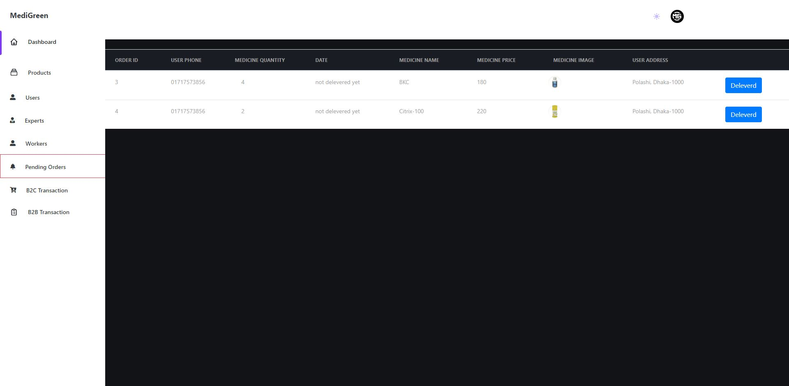
---
